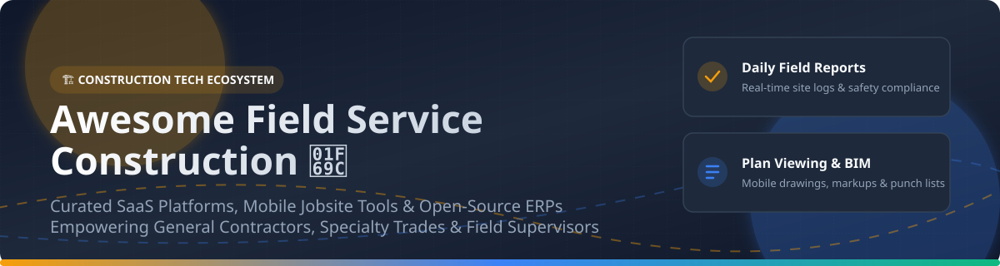

  

# 🏗️ Awesome Field Service Construction 🚜

  
  
  
  
  

---

## 📌 Top Field Service Construction Platforms & Open-Source Ecosystem 📊

**Curated List of Construction Management SaaS Products, Mobile Jobsite Tools & Open-Source GitHub Projects** 🛠️

*Focused on Jobsite Productivity, Mobile Plan Viewing, Daily Reports, Punch Lists, Field Tasks, Safety Compliance & Construction Workforce Coordination* 👷‍♂️👷‍♀️

**Last updated: September 2026** 📅

This repository tracks notable **SaaS platforms** ☁️ and **open-source projects** 🔓 for **Field Service Construction** (construction field productivity, jobsite management, and workforce operations). These software systems help general contractors and specialty sub-contractors efficiently manage digital drawings, mobile task assignments, daily logs, punch lists, labor time tracking, safety inspections, and real-time jobsite coordination.

---

## 📑 Table of Contents

- [🌐 Market Size & Industry Dynamics](#-market-size--industry-dynamics)
- [☁️ SaaS / Hosted Platforms](#%EF%B8%8F-saas--hosted-platforms)
- [🔓 Open-Source GitHub Projects](#-open-source-github-projects)
- [🤝 How to Contribute](#-how-to-contribute)
- [💖 Support & Sponsorship](#-support--sponsorship)
- [📈 Star History](#-star-history)
- [⚠️ Disclaimer](#%EF%B8%8F-disclaimer)

---

## 🌐 Market Size & Industry Dynamics

The global **Construction Field Service & Management Software Market** is estimated at **$3.2 Billion to $4.8 Billion** (2026) and is projecting a ~10-14% CAGR through 2030. The sector remains **moderately fragmented**: while enterprise incumbents (like Procore) command substantial market share among top general contractors, specialized category leaders (Fieldwire, Raken, OpenSpace, HammerTech) dominate niche mobile jobsite workflows, point solutions, and specialty trades.

---

## ☁️ SaaS / Hosted Platforms

Below is a curated comparison of leading enterprise and trade-focused construction field productivity SaaS platforms, sorted by estimated company valuation / revenue scale (descending). 📈

| Platform / Vendor 🏢 | Scale (Valuation / Revenue) 💰 | Starting Price 💵 | Free Tier / Trial Limits ⏳ | Key Features & Jobsite Focus 📋 |
| :--- | :--- | :--- | :--- | :--- |
| **[Procore Field Productivity](https://www.procore.com/)** 🏢 | **~$7.85 Billion Valuation** (~$1.4B Annual Revenue) | Custom quote (Tiered based on annual construction volume) | No free tier; 14-day to 30-day enterprise demo/pilot on request | Unlimited users model; enterprise drawings, daily logs, submittals, labor productivity, & site safety. |
| **[OpenSpace](https://www.openspace.ai/)** 📸 | **~$902 Million Valuation** (~$17M Annual Revenue) | Custom quote (Min. ~$10,000 contract value) | Custom sales demo only (No self-serve free trial) | AI-powered 360° photo capture, automated progress tracking, BIM compare, & searchable visual jobsite records. |
| **[Fieldwire (by Hilti)](https://www.fieldwire.com/)** 📱 | **~$300 Million Valuation** (Acquired for $300M by Hilti) | ~$39 - $54 / user / month (Billed annually) | **Free Forever Tier**: Up to 5 users, 3 projects, & 100 plan sheets; 14-day trial for paid plans | Plan viewing, mobile markups, punch lists, task scheduling, & daily crew coordination. |
| **[Raken](https://www.rakenapp.com/)** 📋 | **~$80 Million Valuation** (~$16.5M - $21.8M Revenue) | Custom quote (Est. ~$23 - $59 / user / month; min 3 users) | 15-day free trial available via sales consultation | Daily site reporting, mobile time cards, toolbox talks, production tracking, & field photo capture. |
| **[HammerTech](https://www.hammertech.com/)** 🛡️ | **~$50 Million+ Valuation** (~$7.9M - $22.9M Revenue) | Custom platform quote (Module-based pricing) | No public free tier; personalized sales demo & pilot setup | Construction EHS (Safety), site orientation, permit to work, incident reporting, & quality compliance. |
| **[Assignar](https://www.assignar.com/)** 🚜 | **~$40 Million Valuation** (~$10M - $50M Revenue) | Custom quote (Tailored to heavy equipment & crew size) | Personalized demo only (No self-serve free trial) | Resource scheduling, heavy equipment dispatching, safety compliance, & field crew time tracking. |
| **[Rhumbix (Autodesk)](https://www.rhumbix.com/)** ⏱️ | **Acquired by Autodesk** (~$8.2M Revenue) | Custom quote (Per-user/per-project structure) | Demo on request (No public free trial) | Field labor timekeeping, daily production tracking, time & materials (T&M) tracking, & site workforce data. |
| **[Fluix](https://www.fluix.io/)** 📝 | **~$15 Million Valuation** (~$7.4M Revenue) | ~$29 / user / month (Crews Plan, min 200 users) | **14-day Free Trial** (No credit card required) | Mobile form automation, digital workflows, inspection checklists, e-signatures, & field paperwork. |
| **[SiteMax](https://www.sitemaxsystems.com/)** 🏗️ | **~$10 Million Valuation** (~$3.1M Revenue) | ~$25 / user / month (Starter Plan) | Free demo & consultative trial period | Field documentation, equipment tracking, safety compliance, time cards, & site photo management. |
| **[Touchplan](https://www.touchplan.io/)** 🗓️ | **Bootstrap / Private** (~$2.6M Revenue) | Custom project package quote | **14-day Free Trial** (30-day live project pilot available) | Collaborative look-ahead scheduling, Last Planner System (LPS), pull-planning, & constraint management. |

---

## 🔓 Open-Source GitHub Projects

The following list contains popular open-source software, ERP modules, and field service frameworks that can be self-hosted and adapted for construction field productivity. Sorted by GitHub star count (descending). ⭐

- **[Odoo Project + Field Service / Community Construction Add-ons](https://github.com/odoo/odoo)**   
  Modular open-source ERP components with comprehensive modules for project management, field service dispatching, task tracking, inventory, and mobile site reporting.

- **[ERPNext Construction Module](https://github.com/frappe/erpnext)**   
  Production-ready open ERP platform containing dedicated construction project estimation, BOQ (Bill of Quantities), site cost tracking, and jobsite procurement workflows.

- **[OpenProject](https://github.com/opf/openproject)**   
  Mature open-source project management platform featuring Gantt charts, work package tracking, Agile boards, and document sharing tailored for construction site coordination.

- **[Redmine Issue & Task Tracker](https://github.com/redmine/redmine)**   
  Flexible web-based issue tracking system frequently customized by contractors for handling RFIs (Request for Information), punch list tracking, and change orders.

- **[OpenConstructionERP (DataDrivenConstruction)](https://github.com/datadrivenconstruction/OpenConstructionERP)**   
  Data-driven open tools and automation scripts designed for analyzing building drawings, BIM data extraction, and field jobsite analytics.

- **[OCA Field Service Management (Odoo Community Association)](https://github.com/OCA/field-service)**   
  Enterprise-grade open-source field service ecosystem providing dispatch management, territory mapping, field technician mobile flows, and order execution.

- **[OpenFieldService](https://github.com/clawnify/OpenFieldService)**   
  Lightweight open-source alternative to commercial field dispatch platforms, providing scheduling, route management, job tracking, and mobile invoicing.

- **[ERPNext Field Service Management Add-on](https://github.com/Beveren-Software-Inc/Field_Service_Management)**   
  Dedicated community module for ERPNext bringing service appointments, field assignment dispatching, and mobile technician checklists.

---

## 💡 Practical Open-Source Construction Workflows

Commercial platforms (Fieldwire, Procore, Raken) excel in mobile offline plan rendering and high-end reality capture. However, cost-conscious contractors can construct a robust self-hosted stack:

1. **Core ERP & Cost Control**: Self-host **ERPNext** or **Odoo** for project budgets, material procurement, sub-contracts, and invoicing.
2. **Scheduling & Work Packages**: Utilize **OpenProject** for look-ahead Gantt schedules, site milestones, and team task assignment.
3. **Punch Lists & Field RFIs**: Deploy **Redmine** or **OCA Field Service** for mobile inspection logging, issue resolution, and sub-contractor task dispatching.

---

## 🤝 How to Contribute

Contributions are highly appreciated! Help keep this field service & construction technology directory comprehensive and accurate.

1. Fork this repository 🍴
2. Create your feature branch (`git checkout -b feature/add-new-tool`)
3. Add your entry to `README.md` following the tabular & markdown style 📝
4. Submit a Pull Request with clear details 🚀

---

## 💖 Support & Sponsorship

If you find this curated resource helpful for your construction tech research or software projects, please consider supporting the maintenance of this repository! 🌟

- ⭐ **Star this repository** to show appreciation and boost visibility!
- 🔀 **Fork & Share** with fellow general contractors, engineers, and developers.
- ☕ **Buy me a coffee**: Support ongoing open-source curation via [GitHub Sponsors](https://github.com/sponsors/ishandutta2007).

---

## 📈 Star History

---

## ⚠️ Disclaimer

- This list is **community-curated** for research and educational purposes. Inclusion does not imply official endorsement.
- Construction sites involve critical life-safety, structural integrity, and legal obligations. Ensure all site operations comply with local building codes, OSHA regulations, and engineering standards.

---

  <b>Made with ❤️ for General Contractors, Specialty Trades &amp; Construction Technology Engineers.</b>

